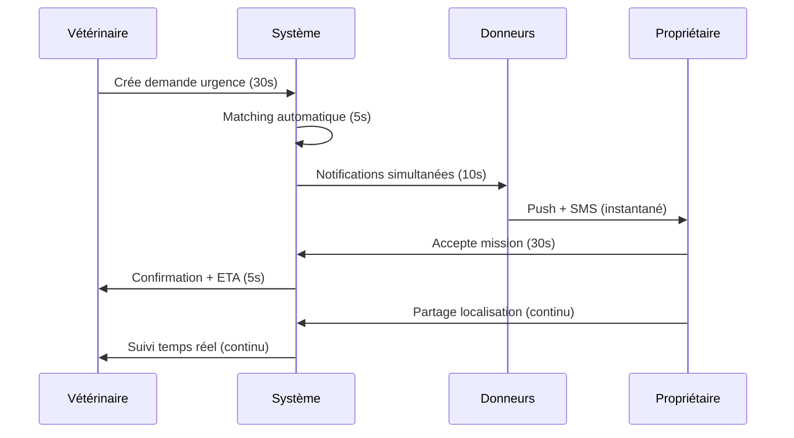
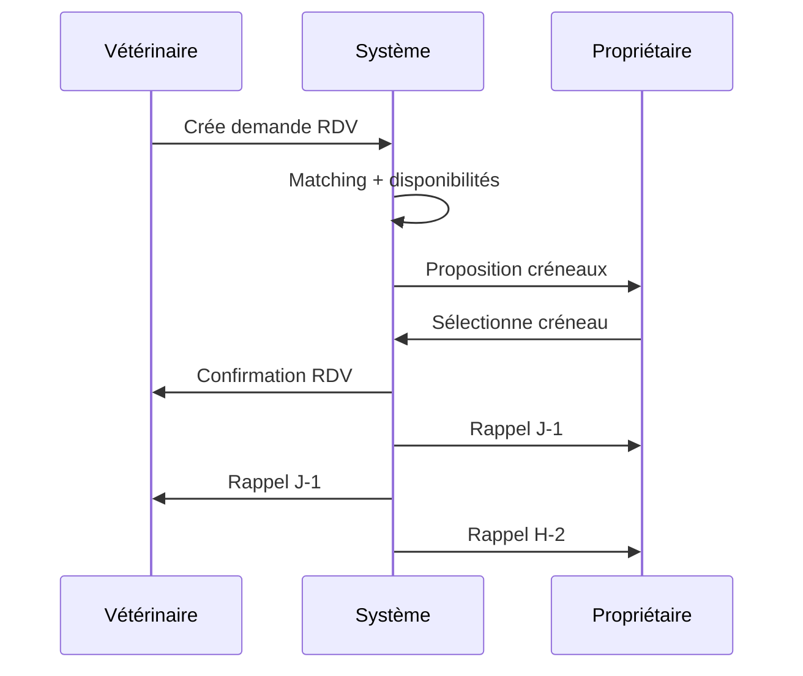

# 📋 CAHIER DES CHARGES TECHNIQUE - REDLINK

## 🎯 VISION PRODUIT

**RedLink** est une plateforme de mise en relation d'urgence entre cliniques vétérinaires et propriétaires d'animaux donneurs pour faciliter les transfusions sanguines. L'enjeu critique est la **rapidité** et la **fiabilité** de la mise en relation en situation d'urgence vitale.

**Mission**: Sauver des vies animales en réduisant le délai de mise en relation de 2-3 heures à 15-30 minutes.

---

## 🏗️ OBJECTIFS TECHNIQUES

### 🎯 Objectifs Primaires

1. **Performance Critique**
   - Temps de réponse API < 500ms (P95)
   - Temps de chargement initial < 2s
   - Disponibilité 99.9% (8h downtime/an max)

2. **Sécurité Médicale**
   - Chiffrement bout-en-bout des données sensibles
   - Traçabilité complète des actions
   - Conformité RGPD + réglementations vétérinaires

3. **Scalabilité**
   - Support 10k utilisateurs simultanés
   - 100k demandes/mois
   - Expansion multi-pays (EU)

4. **Fiabilité d'Urgence**
   - Notifications temps réel < 30s
   - Système de fallback SMS
   - Mode dégradé en cas de panne

### 🎯 Objectifs Secondaires

5. **Expérience Utilisateur**
   - Interface intuitive (< 3 clics pour action critique)
   - PWA avec fonctionnement offline
   - Multilingue (FR, EN, ES, DE)

6. **Intelligence Métier**
   - Algorithme de matching géolocalisé
   - Prédiction de disponibilité
   - Analytics temps réel

---

## 👥 USER STORIES

### 🚨 URGENCES (Priorité Critique)

#### **US-001: Demande d'Urgence Vétérinaire**

```gherkin
En tant que vétérinaire
Je veux créer une demande d'urgence en moins de 60 secondes
Afin de sauver un animal en détresse vitale

Critères d'acceptation:
- Formulaire pré-rempli avec données clinique
- Géolocalisation automatique
- Notification immédiate aux donneurs dans un rayon de 50km
- Confirmation de réception en temps réel
```

#### **US-002: Acceptation Mission d'Urgence**

```gherkin
En tant que propriétaire d'animal donneur
Je veux recevoir et accepter une mission d'urgence en moins de 2 minutes
Afin de contribuer à sauver une vie

Critères d'acceptation:
- Notification push + SMS simultanés
- Informations essentielles visibles (distance, urgence, espèce)
- Acceptation en 1 clic
- Itinéraire automatique vers la clinique
```

#### **US-003: Suivi Temps Réel Mission**

```gherkin
En tant que vétérinaire en urgence
Je veux suivre l'arrivée du donneur en temps réel
Afin de préparer l'intervention

Critères d'acceptation:
- Géolocalisation temps réel du donneur
- ETA dynamique
- Communication directe (chat/appel)
- Notifications d'étapes (départ, arrivée, retard)
```

### 🏥 GESTION CLINIQUE (Priorité Haute)

#### **US-004: Inscription Clinique Vétérinaire**

```gherkin
En tant qu'administrateur de clinique
Je veux inscrire ma structure et mes vétérinaires
Afin d'accéder à la plateforme

Critères d'acceptation:
- Vérification numéro RPPS automatique
- Validation manuelle par équipe RedLink
- Onboarding guidé (5 étapes max)
- Import des données existantes (CSV)
```

#### **US-005: Gestion Équipe Vétérinaire**

```gherkin
En tant qu'administrateur de clinique
Je veux gérer les accès de mon équipe
Afin de contrôler qui peut créer des demandes

Critères d'acceptation:
- Rôles granulaires (admin, vétérinaire, assistant)
- Permissions par type de demande
- Audit trail des actions
- Désactivation temporaire d'accès
```

#### **US-006: Planification Rendez-vous**

```gherkin
En tant que vétérinaire
Je veux planifier des transfusions non-urgentes
Afin d'optimiser les ressources

Critères d'acceptation:
- Calendrier intégré
- Matching automatique avec disponibilités
- Confirmation mutuelle (clinique + donneur)
- Rappels automatiques J-1 et H-2
```

### 🐾 GESTION PROPRIÉTAIRES (Priorité Haute)

#### **US-007: Inscription Propriétaire Donneur**

```gherkin
En tant que propriétaire d'animal
Je veux inscrire mon animal comme donneur
Afin de contribuer aux sauvetages

Critères d'acceptation:
- Formulaire simplifié (3 étapes)
- Validation vétérinaire des informations
- Carnet de santé numérique
- Tests de compatibilité automatiques
```

#### **US-008: Gestion Disponibilités**

```gherkin
En tant que propriétaire donneur
Je veux définir mes créneaux de disponibilité
Afin de recevoir uniquement les demandes pertinentes

Critères d'acceptation:
- Calendrier visuel par semaine
- Disponibilités récurrentes
- Exceptions ponctuelles
- Mode "urgence uniquement"
```

#### **US-009: Historique Donations**

```gherkin
En tant que propriétaire donneur
Je veux consulter l'historique des donations de mon animal
Afin de suivre sa contribution et sa santé

Critères d'acceptation:
- Timeline des donations
- Certificats de donation
- Suivi post-donation (48h)
- Statistiques d'impact (vies sauvées)
```

### 🔍 MATCHING & RECHERCHE (Priorité Moyenne)

#### **US-010: Recherche Géolocalisée Intelligente**

```gherkin
En tant que système
Je veux identifier automatiquement les meilleurs donneurs
Afin d'optimiser les chances de succès

Critères d'acceptation:
- Algorithme multi-critères (distance, compatibilité, disponibilité)
- Score de matching affiché
- Fallback automatique si pas de réponse
- Machine learning sur les succès passés
```

#### **US-011: Filtres Avancés Recherche**

```gherkin
En tant que vétérinaire
Je veux filtrer les donneurs selon des critères spécifiques
Afin de trouver le donneur optimal

Critères d'acceptation:
- Filtres: espèce, groupe sanguin, âge, poids, distance
- Sauvegarde des filtres favoris
- Recherche textuelle (race, nom)
- Export des résultats (PDF)
```

### 💳 PAIEMENTS & FACTURATION (Priorité Moyenne)

#### **US-012: Paiement Sécurisé Donations**

```gherkin
En tant que propriétaire donneur
Je veux être rémunéré pour les donations de mon animal
Afin d'être motivé à participer

Critères d'acceptation:
- Paiement automatique post-validation
- Tarifs transparents par espèce/quantité
- Virements SEPA sous 48h
- Factures automatiques
```

#### **US-013: Facturation Cliniques**

```gherkin
En tant qu'administrateur de clinique
Je veux gérer la facturation des services
Afin de contrôler les coûts

Critères d'acceptation:
- Facturation mensuelle automatique
- Détail par demande/mission
- Exports comptables (CSV, PDF)
- Alertes de dépassement de budget
```

### 📱 NOTIFICATIONS & COMMUNICATION (Priorité Haute)

#### **US-014: Notifications Multi-Canal**

```gherkin
En tant qu'utilisateur
Je veux recevoir les notifications critiques sur tous mes appareils
Afin de ne jamais manquer une urgence

Critères d'acceptation:
- Push notifications (web + mobile)
- SMS de fallback
- Emails de confirmation
- Préférences granulaires par type
```

#### **US-015: Communication Intégrée**

```gherkin
En tant que vétérinaire et propriétaire
Je veux communiquer directement dans l'application
Afin de coordonner efficacement

Critères d'acceptation:
- Chat temps réel
- Appel audio/vidéo intégré
- Partage de localisation
- Historique des conversations
```

### 📊 ANALYTICS & REPORTING (Priorité Basse)

#### **US-016: Dashboard Analytics Clinique**

```gherkin
En tant qu'administrateur de clinique
Je veux analyser les performances de mes demandes
Afin d'optimiser mes processus

Critères d'acceptation:
- Métriques temps de réponse
- Taux de succès par type de demande
- Analyse géographique des donneurs
- Rapports mensuels automatiques
```

#### **US-017: Statistiques Propriétaire**

```gherkin
En tant que propriétaire donneur
Je veux voir l'impact de mes donations
Afin d'être motivé à continuer

Critères d'acceptation:
- Nombre de vies sauvées
- Classement des donneurs actifs
- Badges de reconnaissance
- Partage sur réseaux sociaux
```

---

## 🔧 SPÉCIFICATIONS TECHNIQUES

### 🏗️ Architecture Cible

#### **Frontend (Vue.js 3)**

```typescript
// Structure modulaire recommandée
src/
├── modules/
│   ├── auth/           # Authentification
│   ├── emergency/      # Gestion urgences
│   ├── clinic/         # Espace clinique
│   ├── owner/          # Espace propriétaire
│   ├── matching/       # Algorithme matching
│   └── payments/       # Paiements
├── shared/
│   ├── components/     # Composants réutilisables
│   ├── composables/    # Logique métier
│   ├── utils/          # Utilitaires
│   └── types/          # Types TypeScript
```

#### **Backend (AWS Serverless)**

```yaml
# Architecture recommandée
Services:
  - API Gateway: Routage et throttling
  - Lambda: Logique métier
  - AppSync: GraphQL + temps réel
  - DynamoDB: Base de données principale
  - ElastiCache: Cache Redis
  - SQS: Queues pour notifications
  - SNS: Notifications push/SMS
  - EventBridge: Orchestration événements
```

### 🔐 Règles de Validation Critiques

#### **Compatibilité Groupes Sanguins**

```javascript
// Règles de compatibilité strictes
const BLOOD_COMPATIBILITY = {
  DOG: {
    'DEA 1.1-': ['DEA 1.1-'], // Donneur universel
    'DEA 1.1+': ['DEA 1.1+', 'DEA 1.1-'],
    Dal: ['Dal'],
    Kai: ['Kai'],
  },
  CAT: {
    A: ['A'],
    B: ['B'],
    AB: ['A', 'B', 'AB'], // Receveur universel
  },
}
```

#### **Critères d'Éligibilité Donneur**

```javascript
const DONOR_ELIGIBILITY = {
  weight: {
    DOG: { min: 25, unit: 'kg' }, // Minimum 25kg
    CAT: { min: 4, unit: 'kg' }, // Minimum 4kg
  },
  age: {
    min: 1, // 1 an minimum
    max: 8, // 8 ans maximum
  },
  health: {
    vaccinated: true,
    lastDonation: 56, // 8 semaines minimum entre donations
  },
}
```

#### **Validation Géographique**

```javascript
const GEO_CONSTRAINTS = {
  emergency: {
    maxDistance: 50, // 50km max pour urgences
    maxTravelTime: 45, // 45min max
  },
  appointment: {
    maxDistance: 100, // 100km max pour RDV
    maxTravelTime: 90, // 90min max
  },
}
```

### 📊 Modèle de Données Étendu

#### **Nouvelles Entités Requises**

```graphql
# Notifications temps réel
type Notification @model {
  id: ID!
  type: NotificationType! # EMERGENCY, APPOINTMENT, REMINDER
  priority: Priority! # HIGH, MEDIUM, LOW
  title: String!
  message: String!
  data: AWSJSON # Payload spécifique
  channels: [Channel!]! # PUSH, SMS, EMAIL
  status: NotificationStatus!
  sentAt: AWSDateTime
  readAt: AWSDateTime
  userID: ID!
}

# Audit trail
type AuditLog @model {
  id: ID!
  action: String! # CREATE_REQUEST, ACCEPT_MISSION, etc.
  entityType: String! # Request, Mission, etc.
  entityId: ID!
  userId: ID!
  userRole: UserRole!
  timestamp: AWSDateTime!
  ipAddress: String
  userAgent: String
  changes: AWSJSON # Avant/après pour updates
}

# Géolocalisation temps réel
type LocationUpdate @model {
  id: ID!
  missionId: ID!
  latitude: Float!
  longitude: Float!
  accuracy: Float
  timestamp: AWSDateTime!
  eta: Int # ETA en minutes
}

# Système de rating
type Rating @model {
  id: ID!
  missionId: ID!
  raterType: UserRole! # VET ou OWNER
  rating: Int! # 1-5 étoiles
  comment: String
  createdAt: AWSDateTime!
}
```

### 🚀 APIs Critiques à Implémenter

#### **API Matching Intelligent**

```typescript
interface MatchingRequest {
  requestId: string
  requiredSpecies: Species
  requiredBloodGroup: string
  clinicLocation: GeoPoint
  urgencyLevel: UrgencyLevel
  maxDistance?: number
}

interface MatchingResponse {
  matches: DonorMatch[]
  totalFound: number
  averageDistance: number
  estimatedResponseTime: number
}

interface DonorMatch {
  ownerId: string
  animalId: string
  score: number // 0-100
  distance: number // km
  travelTime: number // minutes
  availability: AvailabilityStatus
  lastDonation?: Date
  successRate: number // Historique
}
```

#### **API Notifications Temps Réel**

```typescript
interface NotificationAPI {
  sendEmergencyAlert(request: EmergencyRequest): Promise<void>
  sendMissionUpdate(mission: Mission, status: MissionStatus): Promise<void>
  sendLocationUpdate(missionId: string, location: GeoPoint): Promise<void>
  markAsRead(notificationId: string): Promise<void>
  getUnreadCount(userId: string): Promise<number>
}
```

#### **API Géolocalisation**

```typescript
interface GeolocationAPI {
  calculateDistance(from: GeoPoint, to: GeoPoint): Promise<number>
  calculateTravelTime(from: GeoPoint, to: GeoPoint): Promise<number>
  findNearbyDonors(center: GeoPoint, radius: number): Promise<Donor[]>
  trackMission(missionId: string): Promise<LocationUpdate[]>
}
```

---

## 🔄 WORKFLOWS CRITIQUES

### 🚨 Workflow Urgence (< 5 minutes total)



### 📅 Workflow Rendez-vous (Planifié)



---

## 🎯 CRITÈRES D'ACCEPTATION GLOBAUX

### 🚀 Performance

- [ ] Temps de réponse API < 500ms (P95)
- [ ] Temps de chargement < 2s (LCP)
- [ ] Score Lighthouse > 90
- [ ] Bundle size < 1MB

### 🔐 Sécurité

- [ ] Chiffrement AES-256 données sensibles
- [ ] Authentification MFA pour vétérinaires
- [ ] Audit trail complet
- [ ] Conformité RGPD

### 📱 Expérience Utilisateur

- [ ] PWA installable
- [ ] Fonctionnement offline
- [ ] Accessibilité WCAG 2.1 AA
- [ ] Support mobile/desktop

### 🔄 Fiabilité

- [ ] Disponibilité 99.9%
- [ ] RTO < 1h (Recovery Time Objective)
- [ ] RPO < 15min (Recovery Point Objective)
- [ ] Tests automatisés > 80% couverture

---

## 📊 MÉTRIQUES DE SUCCÈS

### 🎯 KPIs Métier

| Métrique                      | Objectif  | Mesure                     |
| ----------------------------- | --------- | -------------------------- |
| **Temps de mise en relation** | < 15min   | Moyenne urgences           |
| **Taux de succès missions**   | > 85%     | Missions complétées        |
| **Satisfaction utilisateurs** | > 4.5/5   | NPS trimestriel            |
| **Croissance utilisateurs**   | +20%/mois | MAU (Monthly Active Users) |

### ⚡ KPIs Techniques

| Métrique          | Objectif    | Mesure                |
| ----------------- | ----------- | --------------------- |
| **Disponibilité** | 99.9%       | Uptime monitoring     |
| **Performance**   | < 2s        | Core Web Vitals       |
| **Erreurs**       | < 0.1%      | Taux d'erreur API     |
| **Coûts AWS**     | < $500/mois | Facturation mensuelle |

---

## 🚀 ROADMAP D'IMPLÉMENTATION

### 🏃‍♂️ Phase 1: MVP Consolidation (4 semaines)

- Sécurisation complète (secrets, validation, auth)
- Performance critique (cache, pagination)
- Tests complets (80% couverture)
- Monitoring de base

### 🚀 Phase 2: Matching Intelligent (6 semaines)

- Algorithme de matching avancé
- Notifications temps réel
- Géolocalisation précise
- Communication intégrée

### 🌟 Phase 3: Optimisation & Scale (8 semaines)

- Machine learning matching
- Analytics avancées
- Multi-région
- Intégrations tierces

---

## 🎯 CONCLUSION

Ce cahier des charges définit une plateforme **critique** où chaque minute compte. L'architecture doit privilégier la **fiabilité** et la **performance** avant tout, avec une expérience utilisateur **intuitive** en situation de stress.

**Principe directeur**: "En urgence vétérinaire, la simplicité sauve des vies."
